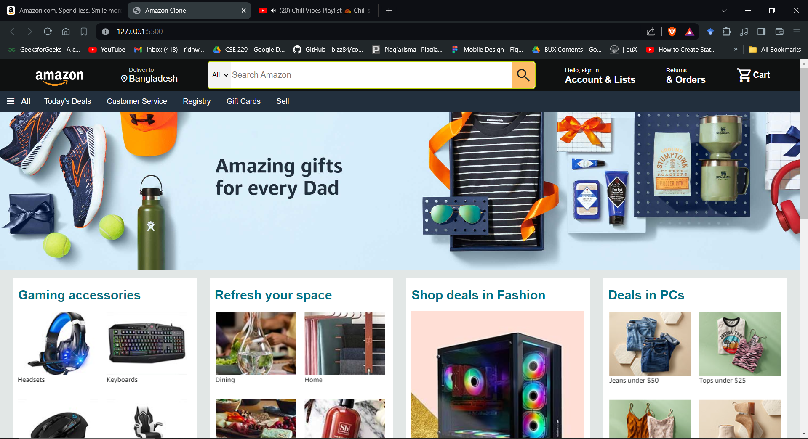

<!DOCTYPE html>
<html lang="en">
<head>
    <meta charset="UTF-8">
    <meta name="viewport" content="width=device-width, initial-scale=1.0">
    <title>Amazon Clone</title>
</head>
<body>

<h1>Amazon Clone</h1>

An exact clone of the Amazon UI as of May 22nd, this project is a front-end website built using only HTML5 and CSS. The purpose of this clone is to deepen the understanding of Amazon's interface, with plans to add additional features in the future.

<h2>Project Overview</h2>

This project replicates the look and feel of the Amazon website, offering users a familiar browsing experience. With carefully crafted HTML and CSS, the clone closely resembles the original Amazon UI, featuring a header, hero section, shopping section, and footer.

<h2>Features</h2>

<ul>
    <li><strong>Header:</strong> Mimics the Amazon header, complete with navigation, search, sign-in, and cart options.</li>
    <li><strong>Hero Section:</strong> Provides a placeholder for hero content, designed to grab users' attention.</li>
    <li><strong>Shopping Section:</strong> Displays various product categories with eye-catching images and links to attract users.</li>
    <li><strong>Footer:</strong> Mirrors the Amazon footer, offering links to different sections, company information, and copyright details.</li>
</ul>

<h2>Preview</h2>

<h2>How to Use</h2>

To view the Amazon clone, simply open the <code>index.html</code> file in a web browser. Explore the various sections to experience the Amazon-like browsing experience.

<h2>Screenshots</h2>

<h2>Dependencies</h2>

<ul>
    <li><a href="https://fontawesome.com/">Font Awesome</a>: Utilized for icons.</li>
    <li><a href="https://fonts.google.com/">Google Fonts</a>: Employed for font styles.</li>
</ul>

<h2>Contributions</h2>

Contributions to this project are welcomed! Fork the repository, make improvements, and submit pull requests adhering to the project's coding standards and guidelines.

<h2>License</h2>

This project is licensed under the <a href="LICENSE">MIT License</a>.

<h2>Acknowledgments</h2>

Special thanks to Amazon for providing the inspiration for this project.

<em>Note: This project is for educational purposes only and is not affiliated with or endorsed by Amazon.</em>

</body>
</html>
